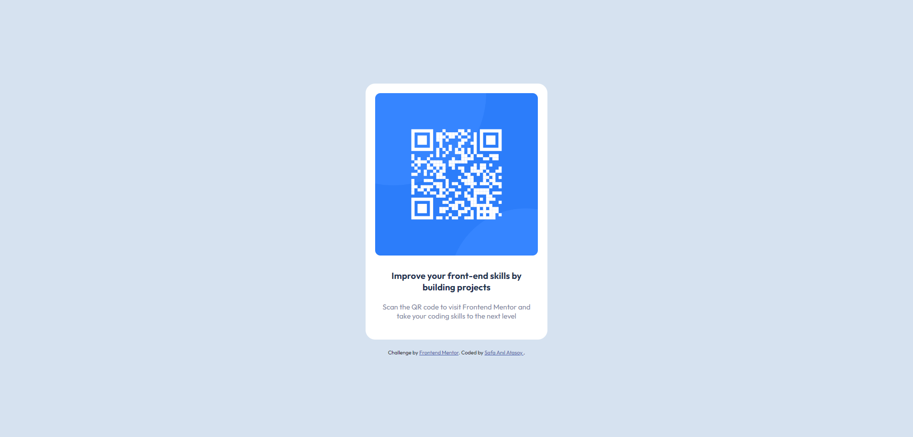

## Overview

### Screenshot

### Links

- Live Site URL: [https://safaanilatasoy.github.io/frontend-mentor-projects/qr-code-project_1/]

## My process

### Built with

- Semantic HTML5 markup
- CSS custom properties
- Flexbox
- CSS Grid
- Mobile-first workflow

### What I learned

Through the completion of this fundamental project, I've gained the expertise to create aesthetically pleasing designs that seamlessly adapt to various screen sizes. This experience has not only enhanced my proficiency in mobile compatibility and responsiveness but has also deepened my understanding of user-centric design principles.

### Continued development

In the future of this project, I plan to create a website that allows users to generate personalized QR codes, rather than just a static QR code.

### Useful resources

- [Flatui](https://flatuicolors.com) - Thanks to this website, I can easily switch between color palettes and conveniently copy my favorite colors with just a single click. I highly recommend it!
- [Github Pages](https://pages.github.com/) - I was able to easily take my project live by simply creating a repository, so I highly recommend it.

## Author

- Website - [Add your name here](https://www.your-site.com)
- Frontend Mentor - [@safaanilatasoy](https://www.frontendmentor.io/profile/safaanilatasoy)
- LinkedIn - [@safaanilatasoy](https://www.linkedin.com/in/safaanilatasoy/)
- Github - [@safaanilatasoy](https://github.com/safaanilatasoy)
- HackerRank - [@safaanilatasoy](https://www.hackerrank.com/profile/safaanilatasoy)
